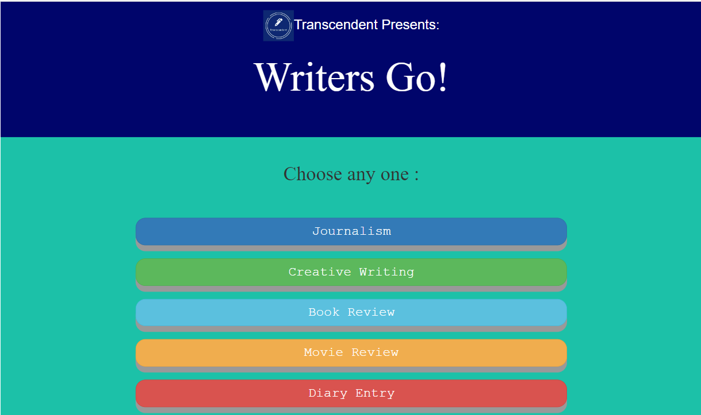

# WritersGo

This is an online portal for our College Writing Club to organize a Writing Competition online. We used Flask's internal template engine for front-end and Google Firebase for back-end. The topics for the competition as well as the user entries are stored in Firebase. For each user, a topic is generated randomly from the list of topics in the DB.

## How to Run

> Download/clone the repository\
> cd WritersGo\
> Create a virtual environment venv\
> run venv/scripts/activate\
> run python -m pip install flask\
> run python -m pip install pyrebase4\
> run python -m flask run\

## Output

